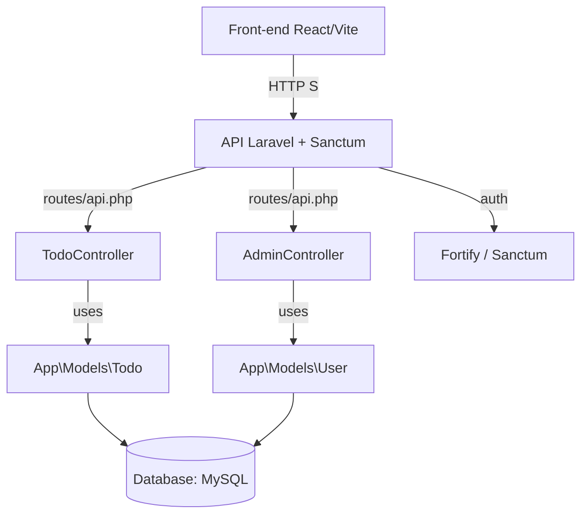
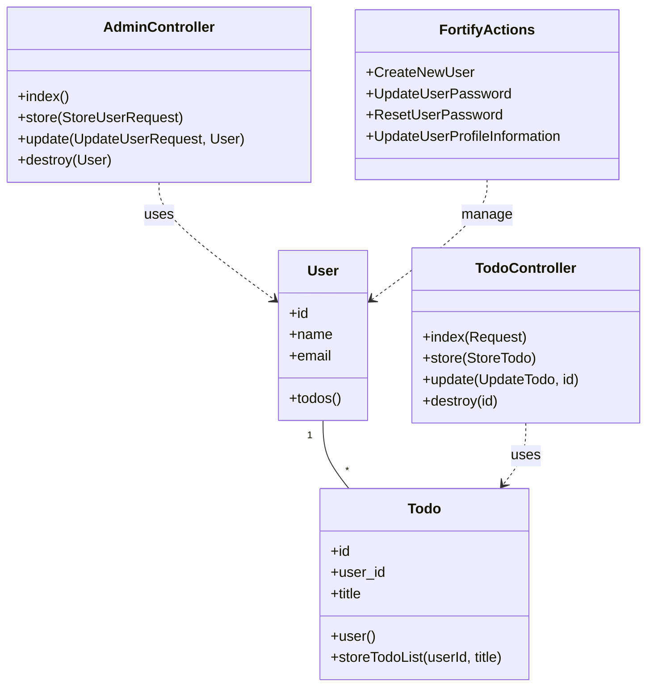

# Reactの買い物リスト  

  
  


  


  


  

## プロジェクト概要
- Laravel 13ベースのバックエンドと、React + TypeScript + Vite のフロントエンドを含む構成。
- backend 側は Laravel アプリケーション、frontend 側は React SPA。
- Docker Compose で `app` / nginx / `node` / `db(mysql)` / `phpmyadmin` を起動する構成。
- 実装済み機能は、Todo リソースのCRUD APIと、それを呼び出す React フロントエンド。
- 管理者ユーザー管理機能

## 学習・検証目的
- CRUD + API通信の理解
- バックエンドからフロントエンドへ
- SPAでの認証についての理解
- バックエンドを中心とした開発において、フロントエンドとの連携に必要な知識・実装の理解
- React / TypeScriptからLaravel APIを利用する一連の流れの検証

## 主な機能
- CRUD + API通信
  - `TodoController` にて `index`, `store`, `update`, `destroy` を実装
  - `AdminController` にて 管理者向けユーザー管理 API（一覧・作成・更新・削除）
- 認証フロー
  - ユーザー認証（Fortify）
  - API 認証（Sanctum ミドルウェア適用）
- フロントエンド骨格（React + TypeScript + Vite + Tailwind）

## 使用技術
| カテゴリ | 使用技術 |
| :--- | :--- |
| **Backend** | Laravel 13 |
| **Frontend** | React `^19.2.7`, Tailwind CSS, Node.js |
| **Authentication / Authorization** | Fortify |
| **Infrastructure** | Docker Compose (App / Node / MySQL / Nginx) |
| **OS Environment** | WSL2 (Ubuntu / Alpine Linux) |
| **Database** | MySQL 8.x |

## セットアップ手順

### 1. インフラのビルドと起動
```
docker compose build
docker compose up -d
```

### 2. バックエンド初期化
```
docker compose exec app ash
composer create-project laravel/laravel .
chown -R www-data:www-data storage bootstrap/cache
chmod -R 775 storage bootstrap/cache
composer require laravel/sanctum
php artisan install:api
```
#### 3. 認証packcageの導入
```
composer require laravel/fortify
php artisan fortify:install
```
### 4. フロントエンド初期化
```
docker compose run --rm node sh
npm create vite@latest . -- --template react-ts
npm install
npm install tailwindcss @tailwindcss/vite
```
#### 5. .env修正・作成  
※ バックエンドはcompose.ymlに設定した内容に修正。
※ フロントエンドは作成する。
```
VITE_API_URL=http://localhost:8000/api
```
#### 6. マイグレーション
```
php artisan migrate
```
#### 7. その他(バックエンド)
```
composer require --dev "squizlabs/php_codesniffer=*"
composer require --dev barryvdh/laravel-debugbar
composer require laravel-lang/lang:~8.0
php artisan lang:publish
cp ./vendor/laravel-lang/lang/json/ja.json ./lang/
cp -r ./vendor/laravel-lang/lang/src/ja ./lang/
```

#### 8. 認証の設定
※下記で、`config/core.php`
```
php artisan config:publish cors
```
```
    'allowed_origins' => ['http://localhost:5173'],
    'supports_credentials' => true,
```
## ディレクトリ構成（主要部分）
- compose.yaml
- php
  - `Dockerfile`
- nginx
  - `default.conf`
- backend
  - `artisan`
  - composer.json
  - package.json
  - .env.example
  - `routes/`
    - web.php
    - api.php
  - `app/`
    - `Http/`
      - `Controllers/`
        - Controller.php
        - `Api/TodoController.php`
    - `Models/`
      - Todo.php
      - User.php
    - `Providers/`
      - AppServiceProvider.php
  - `resources/`
    - `views/`
      - welcome.blade.php
  - `database/`
    - `migrations/`
- frontend
  - package.json
  - README.md
  - `src/`
    - `components/`
     - `Layout/`
      - AppLayout.tsx
     - `Todo/`
      - TodoForm.tsx
      - TodoItem.tsx
      - TodoList.tsx
     - `User/`
      - UserForm.tsx
      - UserItem.tsx
    - `Types/`
      - Todo.ts
    - `utils/`
      - apiFetch.ts
    - App.tsx
    - `main.tsx`
    - `App.css`
    - `login.tsx`
    - `Register.tsx`
  - `public/`

## 設計・実装の特徴
- `Route::apiResource('todos', TodoController::class)->only([...])` で Todo API を RESTful に定義
- `TodoController` はコンストラクタプロパティプロモーションで `Todo` モデルを注入
- `index()` は `JSON_PRETTY_PRINT | JSON_UNESCAPED_UNICODE` 付きの JSON レスポンス
- `App\Models\User` は PHP 8 の属性ベースで `Fillable` / `Hidden` を定義し、`password` を `hashed` にキャスト
- フロントエンドは React Hooks でシンプルに API 連携し、CRUD 操作を実装

---

## 処理の流れ

## クラス構成図

## 今後の改善予定
- 後で書く
- 後で書く  

[](https://www.loom.com/share/f1c61223d89d4a6d8e3178d5b03df2fc)

[▶️ 動作デモ動画を視聴する（Loom）](https://www.loom.com/embed/f1c61223d89d4a6d8e3178d5b03df2fc)