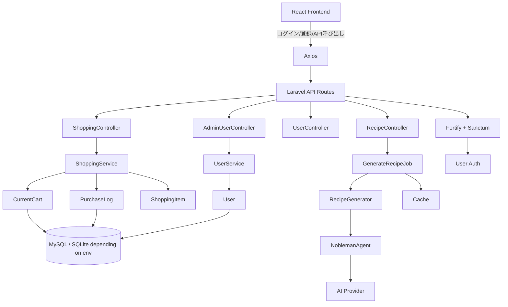
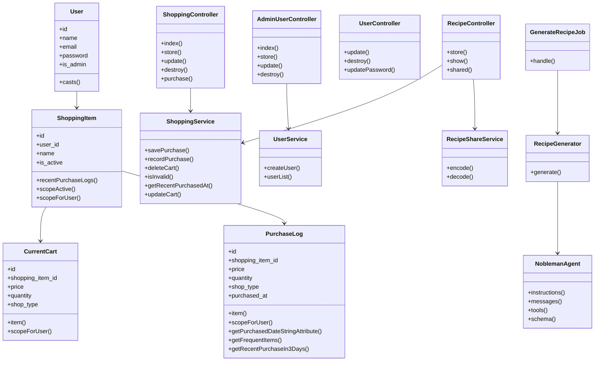

# Reactの買い物メモ+AI献立提案  

  
  


  


  


  

## プロジェクト概要
このリポジトリは、バックエンドに Laravel、フロントエンドに React + TypeScript + Vite を持つ SPA 型の買い物支援アプリケーションです。

確認できた実装の軸は次の通りです。

- Backend: Laravel 13 を使用した API と認証基盤
- Frontend: React 19 + TypeScript + Vite によるシングルページアプリケーション
- 購入リストと購入履歴の管理
- 管理者向けユーザー管理
- AI を利用した献立候補生成と共有
- Docker Compose による開発環境の定義
- PWA対応
- 以前実装したLivewire版買い物リストをReactへ移植。

実際に確認できたファイル上では、フロントエンドのメイン画面は `App.tsx` で認証状態やパスに応じてログイン画面、買い物画面、管理者画面、設定画面を切り替えています。


## 学習・検証目的
- CRUD + API通信の理解
- 以前実装したLivewire版買い物リストをReactで実装仕直す。
- SPAでの認証についての理解
- バックエンドを中心とした開発において、フロントエンドとの連携に必要な知識・実装の理解
- React / TypeScriptからLaravel APIを利用する一連の流れの検証

## 主な機能
- CRUD + API通信
  - `ShoppingController` にて `index`, `store`, `update`, `destroy` を実装
  - `AdminController` にて 管理者向けユーザー管理 API（一覧・作成・更新・削除）
- 認証フロー
  - ユーザー認証（Fortify）
  - API 認証（Sanctum ミドルウェア適用）
- フロントエンド骨格（React + TypeScript + Vite + Tailwind）
- 管理者チェック用ミドルウェア
  - ユーザー一覧取得
  - ユーザー追加
  - ユーザー更新
  - ユーザー削除
- AI を利用した献立候補生成と共有
  - 食材入力の検証
  - 献立生成ジョブのキュー投入
  - Job 実行中の状態管理（Cache を使用）
  - AI エージェントによる構造化出力
  - 生成結果の共有 URL 作成
  - 共有 URL からのレシピ復元

## 使用技術
| カテゴリ | 使用技術 |
| :--- | :--- |
| **Backend** | Laravel 13 |
| **Frontend** | React `^19.2.7`, Tailwind CSS, Node.js |
| **AI** |Laravel AI / Gemini（AI SDK） |
| **Authentication / Authorization** | Fortify |
| **Infrastructure** | Docker Compose (App / Node / MySQL / Nginx) |
| **OS Environment** | WSL2 (Ubuntu / Alpine Linux) |
| **Database** | MySQL 8.x |

## セットアップ手順

### 1. インフラのビルドと起動
```
docker compose build
docker compose up -d
```

### 2. バックエンド初期化
```
docker compose exec app ash
composer create-project laravel/laravel .
chown -R www-data:www-data storage bootstrap/cache
chmod -R 775 storage bootstrap/cache
composer require laravel/sanctum
php artisan install:api
```
#### 3. 認証packcageの導入
```
composer require laravel/fortify
php artisan fortify:install
```
### 4. フロントエンド初期化
```
docker compose run --rm node sh
npm create vite@latest . -- --template react-ts
npm install
npm install tailwindcss @tailwindcss/vite
npm install @iconify/react
```
#### 5. .env修正・作成  
※ バックエンドはcompose.ymlに設定した内容に修正。
※ フロントエンドは作成する。
```
VITE_API_URL=http://localhost:8000/api
```
#### 6. マイグレーション
```
php artisan migrate
```
#### 7. その他(バックエンド)
```
composer require --dev "squizlabs/php_codesniffer=*"
composer require --dev barryvdh/laravel-debugbar
composer require laravel-lang/lang:~8.0
php artisan lang:publish
cp ./vendor/laravel-lang/lang/json/ja.json ./lang/
cp -r ./vendor/laravel-lang/lang/src/ja ./lang/
```

#### 8. その他(フロントエンド)
```
npm install axios
npm list axios
```

#### 9. 認証の設定(バックエンド)
※下記で、`config/core.php`
```
php artisan config:publish cors
```
```
    'allowed_origins' => ['http://localhost:5173'],
    'supports_credentials' => true,
```

#### 10. AI SDK の導入(バックエンド)
```
composer require laravel/ai
php artisan vendor:publish --provider="Laravel\Ai\AiServiceProvider"
php artisan migrate
php artisan make:agent NoblemanAgent --structured
```
※Gemini無料枠使用、`.env` ファイルを編集して、データベース接続情報と AI API キーを設定してください。  
※`config/ai.php`にて'default'の値も使用するAIに変更してください。


## ディレクトリ構成（主要部分）
- compose.yaml
- php
  - `Dockerfile`
- nginx
  - `default.conf`
- backend
  - `artisan`
  - composer.json
  - package.json
  - .env.example
  - `routes/`
    - web.php
    - api.php
  - `app/`
    - `Http/`
      - `Controllers/`
        - Controller.php
        - `Shopping/`
          - ShoppingController.php
          - RecipeController.php
        - `User/`
          - UserController.php
        - `Admin/`
          - AdminUserController.php
      - `Middleware/`
        - Admin.php
      - `Requests/`
        - StoreShoppingRequest.php
        - UpdateShoppingRequest.php
        - SuggestionRequest.php
        - UpdateProfileRequest.php
        - UpdatePasswordRequest.php
    - `Models/`
      - User.php
      - ShoppingItem.php
      - CurrentCart.php
      - PurchaseLog.php
    - `Services/`
      - ShoppingService.php
      - RecipeGenerator.php
      - RecipeShareService.php
      - UserService.php
    - `Jobs/`
      - GenerateRecipeJob.php
    - `Ai/`
      - `Agents/`
        - NoblemanAgent.php
    - `Providers/`
      - AppServiceProvider.php
      - FortifyServiceProvider.php
    - `Actions/`
      - `Fortify/`
        - CreateNewUser.php
        - UpdateUserPassword.php
        - ResetUserPassword.php
        - UpdateUserProfileInformation.php
        - PasswordValidationRules.php
    - `Enums/`
      - ShopType.php
  - `resources/`
    - `views/`
      - welcome.blade.php
  - `database/`
    - `migrations/`
- frontend
  - package.json
  - README.md
  - `src/`
    - `components/`
      - `Layout/`
        - AppLayout.tsx
      - `Header.tsx`
      - `BottomNav.tsx`
      - `ApplicationLogo.tsx`
    - `pages/`
      - `shopping/`
        - ShoppingPage.tsx
        - ListSection.tsx
        - EditForm.tsx
        - HistorySection.tsx
        - `recipe/`
          - RecipeSection.tsx
          - RecipeCard.tsx
          - RecipeSharePage.tsx
      - `Admin/`
        - `User/`
          - UserForm.tsx
          - UserItem.tsx
          - UserEditForm.tsx
        - AdminUserPage.tsx
      - `Settings/`
        - SettingsPage.tsx
    - `utils/`
      - axios.ts
    - App.tsx
    - `main.tsx`
    - `login.tsx`
    - `Register.tsx`
  - `public/`

## 設計・実装の特徴設計・実装の特徴
- バックエンドはサービス層とモデル層に分離
  - ShoppingService
  - UserService
  - RecipeGenerator
  - RecipeShareService
- モデルでスコープとキャストを定義
- AI 献立生成はジョブ化
- フロントエンドは状態管理を React の useState / useEffect で実施
- フロントエンドは React Hooks でシンプルに API 連携し、CRUD 操作を実装

---

## 処理の流れ

## クラス構成図

## 今後の改善予定
- キュー処理の改善検討